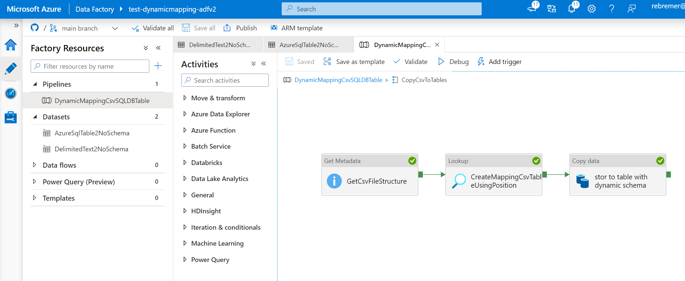

# Project that enables to do dynamic mapping from csv files in tables in single pipeline

## Dynamic mapping
Dynamic mapping is based on position, ,e.g.

- CSV file 1 with ```voornaam, achternaam, leeftijd``` will be written to Table 1 as ```firstname, lastname, age```
- CSV file 2 with ```IBAN1, price, price1, price2``` will be written to Table 2 as ```IBAN, price, SalesPrice, PurchasePrice```

Mapping is done dynamically using this [stored procedure](_StoredProcedure\sp_doSourceSinkColumnMapping.sql) to create a mapping between csv file and table name bases on position rather than name. Two additional remarks:
- No custom config table needs to be maintained keeping track of mapping, ADFv2 activity getmetadata and SQLDB sys.columns are used by stored procedure to do mapping dynamically. 
- This project elaborates on the following blog: https://sqlitybi.com/dynamically-set-copy-activity-mappings-in-azure-data-factory-v2/?doing_wp_cron=1617948385.9531490802764892578125

## Pipeline is created as follows:
- Use ForEach to loop to add file 1..N to table 1..N using array parameter where source files/sink tables are specified 
- Use Get Metadata activity to get the csv file structure
- Pass CSV file structure and tablename to stored procedure. Stored procedure creates mapping between csv file structure and table columns based on position using sys.columns.
- Use dynamic mapping in sink mapping to write csv file data to table

See als picture below



## Steps to execute:
- Clone this git repository, create a new Azure Data Factory instance and import the git
- Create SQLDB, Storage account and make sure Azure Data Factory can access storage and SQLDB
- Add csv files in _ExampleData to storage account, create tables in _ExampleData in SQLDB
- Create sp_doSourceSinkColumnMapping.sql in your SQLDB. This is where the heavy lifting is done.
